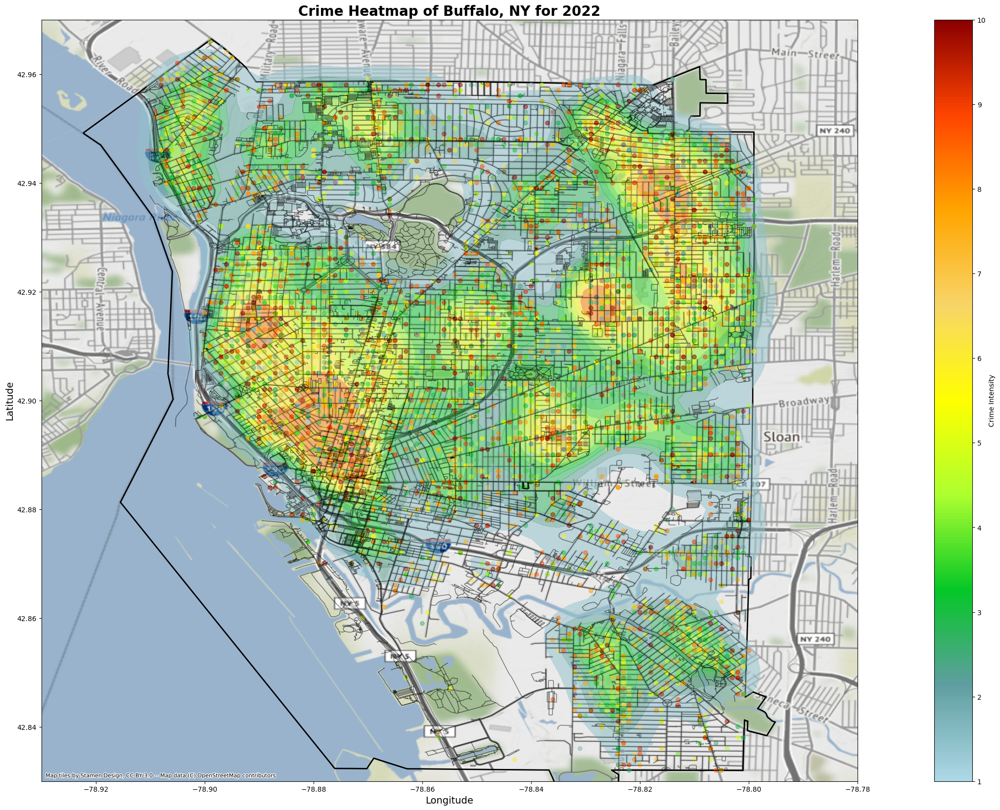
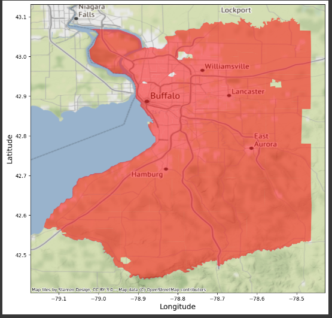
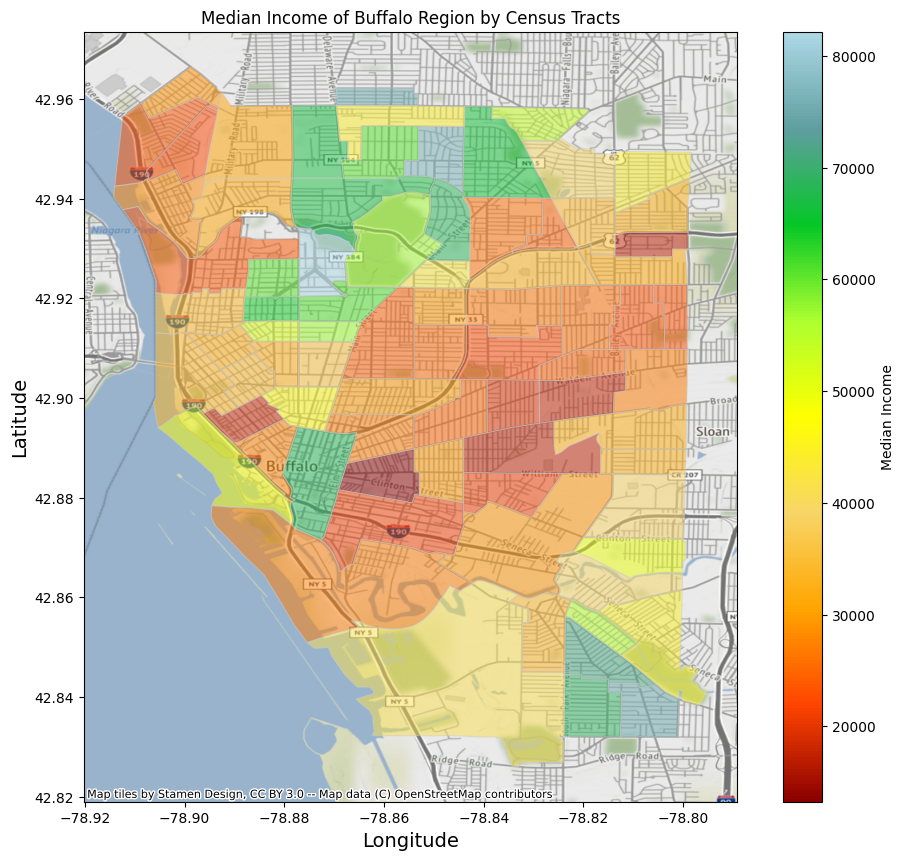
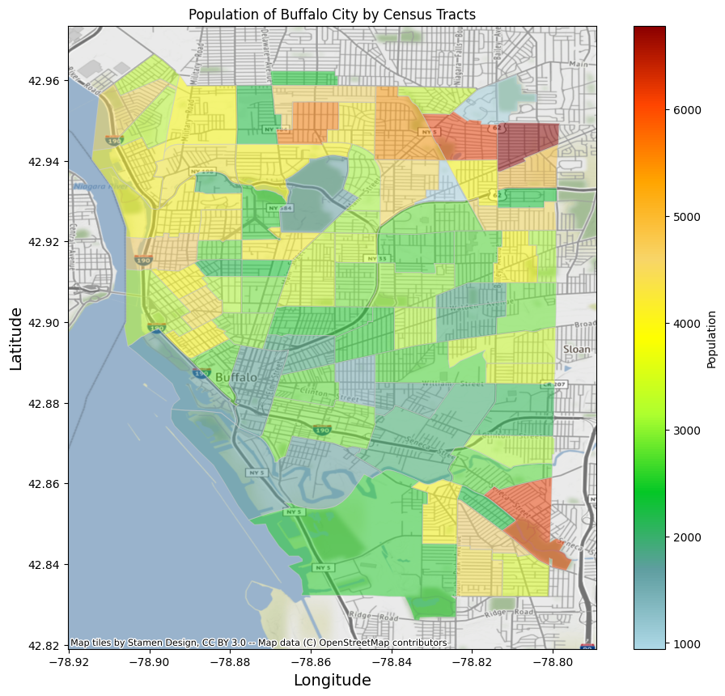
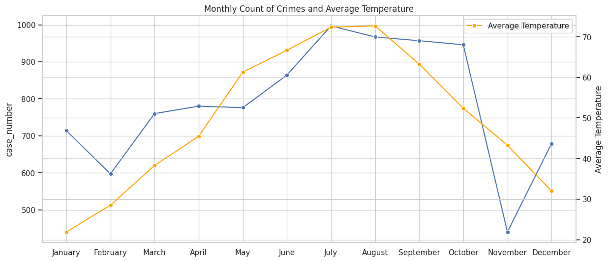

# Buffalo Crime Analysis

Authors:  **Arvind Rathore**, **Sudhanshu Gupta**, **Gautham Srinivasan**, **Swaroop Sateesha**

YouTube Video:https://youtu.be/V4Vi8mMimDI

code: https://github.com/IE-555/final-project-arvindUB/blob/main/CrimeDataAnalysis.ipynb

## Task List

| ID | Task Description | Responsibility | Due Date | Status |
| --- | --- | --- | --- | --- |
| 1 | Check for missing values,duplicates, and errors <br> - Provide an action plan for these values and the reasoning behind it. | Gautham | April 30 | Done |
| 2 | Create a table that has the following details (Only needs to be done for useful columns/features) <br> -Name of the column or feature from the JSON file.<br> -Type of information it provides to us (Location, Date Time, etc.) <br> -What is the data type for this column.<br> -How many unique values it contains.<br> -How many total values it contains.<br> -What information are these above useful columns/features telling us?  | Sudhanshu | April 30 | Done |
| 3 | Provide a description of each column and the information it presents<br> -Provide the extent of the values in the column<br> -if numbers: what is the range?<br> -if categories: how many different categories are there and what do they mean?<br> -Why is this column useful for us? | Swaroop | April 30 | Done |
| 4 | create a dictionary that assigns weights to each type of crime, violent crimes with bigger impact on society are assigned higher values. | Arvind | May 3 | Done |
| 5 | import the map of buffalo from the OpenStreetMaps package. This map consists of the streets of buffalo.  | Gautham | May 6 | Done |
| 6 | Similarly, obtain the outline of the city of buffalo from OpenStreetMaps package.  | Sudhanshu | May 9 | Done |
| 7 | assign each crime incident in the crime incidents dataframe with value according to the created dictionary.  | Swaroop | May 12 | Done |
| 8 | we create a KDE plot with the map and outline of buffalo as the background and the crime incidents as data points. The color mapping is chosen such that the red areas represent higher crime intensity.  | Arvind | May 15 | Done |
| 9 | Report preparation and youtube video creation | All | May 17 | Done |

--- 

## Introduction

- *In this project, we delve into the **Crime Incidents in the city of Buffalo** to identify crime hotspots based on the type and time of crimes. Additionally, we explore the **relationship between these crime hotspots and median income levels and population density**. By utilizing data visualization techniques, we aim to create geospatial maps that showcase crime hotspots alongside income distribution and population density.;*
- *The primary data source for our analysis is the Buffalo Crime Data API, which provides comprehensive information about crime incidents, including their location, type, and timestamp. This dataset allows us to gain insights into the patterns and trends of criminal activities in Buffalo. Further to find correlation to the crime data, we integrated data from the United States Census Bureau. Specifically, we extract median income levels and population statistics for different regions in Buffalo. These metrics provide a socioeconomic backdrop to our analysis, allowing us to explore the relationship between crime hotspots and income levels, as well as population density.;*
- **Analysis Steps**
  - ***Step 1: Data Retrieval and Preprocessing** We start by accessing the crime data directly through the Buffalo Crime Data API. This API allows us to retrieve detailed information about crime incidents, including their location, type, and timestamp. Additionally we access the median income and population data from United States Census Bureau API. Once obtained, we preprocess the data by examining for missing values, duplicates, and inconsistencies. Cleaning the data ensures that our subsequent analysis is based on reliable and accurate information.;*
  - ***Step 2: Exploratory Data Analysis (EDA)** In this step, we conduct exploratory data analysis to gain insights into the characteristics and patterns of crime incidents in Buffalo. We find out the frequency of different crime types, identify trends in crime occurrences over time, and examine any notable variations in crime distribution across different areas of the city. EDA provides a foundation for understanding the underlying dynamics of crime in Buffalo.;*
  - ***Step 3: Data visualization** It plays a crucial role in our analysis, as it facilitates the interpretation and communication of findings. We have leveraged visualization techniques to plot crime hotspots on geospatial maps, highlighting areas with higher crime rates. Moreover, we have compared these crime hotspots with the median income levels of different regions in Buffalo by visualizing income distribution on geospatial maps. This comparison will provide insights into the potential relationship between crime patterns and socioeconomic factors. Furthermore, we have analyzed the population density of various areas in Buffalo by mapping the population data, enabling us to examine the interplay between crime and population.;*
  - ***Step 4: Interpretation and Recommendations** Finally, we interpret the results of our analysis and draw meaningful conclusions.;*
 
- *By conducting this analysis, we aim to gain comprehensive insights into the crime landscape of Buffalo. The identification of crime hotspots and their correlation with income levels and population density can offer valuable guidance to improve public safety.;*

---

## References
- Crime Incidents Data - https://data.buffalony.gov/Public-Safety/Crime-Incidents/d6g9-xbgu
- United States Census Bureau - https://www.census.gov/data/developers/data-sets/acs-5year.html
- ChatGPT 
  - What table number in census.gov shows the data about median income for households and individuals for Buffalo City, New York
  - It needs to have the median income by census tracts
  - How do I get this table with complete GEOIDs
  - Write a code that produces Median income data from the census.gov API for Buffalo City, New York in python
  - Plot these incomes as a graduated color map on the map of buffalo taken from osm with basemap from contextily
  - The "city = ox.geocode_to_gdf('Buffalo, New York, USA')" only has the polygon for the entire city of buffalo.
  - Can you create a GDF for polygon geometry of each census tract in the city of buffalo along with the GEOID for each of them
  - Can we use the polygon geometry we got from osmnx for buffalo city to drop the rows that have geometry outside the osmnx geometry?
  - This is also removing all the border polygons completely. It seems that the within function is too strict. What can you do?
  - This somehow is still not considering the bordering polygons. What can we use?
  - Get data with GEOID about population for each census tract for Buffalo city. Plot this population on a graph. To plot follow these steps:
  - Get the polygon geometry for each census tract from TIGER/lines from the year 2019.
  - Get basemap from Contexily. Use the default source.
  - Filter the polygon for only within the buffalo city by first getting the buffalo city outline from OSM and then using a buffer around the city outline. Then
  - use within method with mask to filter the polygons with the city borders.
  - Plot these on a map and display a cmap to show the population at each census tract.
  - Please show a label next to the Legend (a cbar). The label should say 'Median Income'

---

## Requirements
- *To run this jupyter notebook you need to install:*
  - Numpy
  - Pandas
  - Geoplot, Geopandas (If you have windows use https://medium.com/analytics-vidhya/fastest-way-to-install-geopandas-in-jupyter-notebook-on-windows-8f734e11fa2b to install)
  - Contextily
  - Shapely
  - Osmnx

- *Census API Key, which can be generated from: https://api.census.gov/data/key_signup.html. Please store this key in your environment variable to use in the code or paste directly where it says ‘api_key: <paste here>’*

---

## Explanation of the Code

- **Part 1 Creating Visualiztion of Crime Heat Map Buffalo NY-**
  
The code, `CrimeDataAnalysis.py`, begins by installing librarires in Jupyter notebook
```
!pip3 install Numpy Pandas Geoplot Geopandas Contextily Shapely Osmnx
```

To import all the required libraries.
```
import numpy as np
import geopandas as gpd 
# import geoplot as gplt
# import geoplot.crs as gcrs
import matplotlib.pyplot as plt
import pandas as pd
import os
````

This code block is the call to API to get data for the specified year. Then it filters this data to get just columns required for the visualization.
```
import json
import requests

# Set Year
year = 2022

# API endpoint
url = "https://data.buffalony.gov/resource/d6g9-xbgu.json"

# Add query parameters to limit the number of results
params = {
    "$where": f"incident_datetime between '{year}-01-01T00:00:00.000' and '{year}-12-31T23:59:59.000'",
    "$limit": 100000
}

response = requests.get(url, params=params)

# Status Code 200 means successful query
if response.status_code == 200:
    # Parse the JSON data
    crime_incidents = response.json()

    crime_incidents_df = pd.DataFrame.from_records(crime_incidents, columns=['incident_datetime', 'incident_type_primary', 'longitude', 'latitude']).dropna()

else:
    print(f"Error: Unable to fetch data from API (status code {response.status_code})")
```

To obtain the dataframe that consists of only the required columns to create the map.
```
crime_incidents_df
```
**Crime Incidents Data Frame:**


  
  
Assigning weights based on the intensity of crime
```
crime_weights = {
    "LARCENY/THEFT": 1,
    "UUV": 2,
    "ROBBERY": 3,
    "BURGLARY": 4,
    "ASSAULT": 5,
    "AGGR ASSAULT": 6,
    "RAPE": 7,
    "SEXUAL ABUSE": 8,
    "THEFT OF SERVICES": 1,
    "MURDER": 10,
    "Breaking & Entering": 4,
    "Theft": 1,
    "CRIM NEGLIGENT HOMICIDE": 9,
    "Sexual Assault": 7,
    "MANSLAUGHTER": 9,
    "AGG ASSAULT ON P/OFFICER": 6,
    "Theft of Vehicle": 2,
    "Homicide": 10,
    "Other Sexual Offense": 8,
    "SODOMY": 8,
}
```
The code block retrieves street network data and geographical boundary information for Buffalo, New York, using the OSMnx library. It converts crime incident data stored in a DataFrame into a GeoDataFrame, associating latitude and longitude points with the corresponding attribute data. The street network data is also converted into a GeoDataFrame for visualization purposes. Additionally, the code assigns weights to the crime incidents based on a predefined dictionary and converts the latitude and longitude columns to numeric data types for further analysis.
```
import osmnx as ox
from shapely.geometry import Point

# Fetch the street network data of Buffalo city
buffalo_street_graph = ox.graph_from_place("Buffalo, New York, USA", network_type="all") # Streets of Buffalo (DiGraph Object)
buffalo_neighborhoods = ox.geocode_to_gdf("Buffalo, New York, USA") # Border of Buffalo City

# Convert the DataFrame to a GeoDataFrame
geometry = [Point(xy) for xy in zip(pd.to_numeric(crime_incidents_df['longitude']), pd.to_numeric(crime_incidents_df['latitude']))]
gdf = gpd.GeoDataFrame(crime_incidents_df, geometry=geometry)

# Convert the street_graph into a GeoDataFrame. This allows us to plot the graph on the map.
street_gdf = ox.graph_to_gdfs(buffalo_street_graph)[1]

# Assign weights to the Crime Incident GeoDataFrame as per the crime weights dictionary
gdf['weights'] = gdf['incident_type_primary'].map(crime_weights)

# Convert 'longitude' and 'latitude' columns to numeric data types
gdf['longitude'] = pd.to_numeric(gdf['longitude'])
gdf['latitude'] = pd.to_numeric(gdf['latitude'])
```

Creates a custom color map to be used in the sns.kde block for the map.
```
# Custom color maps
from matplotlib.colors import LinearSegmentedColormap

colors = ["#add8e6", "#5f9ea0", "#04c726", "#adff2f", "#ffff00", "#f8d568", "#ffa500", "#ff4500", "#8b0000"]
custom_cmap = LinearSegmentedColormap.from_list("custom_cmap", colors)
```
  
The code block visualizes a crime heatmap of Buffalo, NY. It sets up the projection for the basemap and converts the GeoDataFrames to the Web Mercator projection. The code then creates a plot with the streets and outline of Buffalo city, overlays a KDE plot of crime incidents using latitude and longitude coordinates, and adjusts the plot aesthetics such as bandwidth, colormap, transparency, and legend. The map limits are controlled to focus on the city area, and a color bar is added to represent crime intensity. A background image is added using the Contextily library, and the plot is finalized with a title and axis labels before displaying it.

```
import seaborn as sns
import contextily as ctx
import matplotlib as mpl

# Set the projection for the basemap
web_mercator_crs = "EPSG:4326"
gdf.crs = "EPSG:4326"
gdf_web_mercator = gdf.to_crs(web_mercator_crs)
buffalo_neighborhoods_web_mercator = buffalo_neighborhoods.to_crs(web_mercator_crs)

# Plot size
fig, ax = plt.subplots(figsize = (40, 20))

# The streets of Buffalo city
street_gdf.plot(ax=ax, edgecolor='black', facecolor='none', linewidth=1, alpha=0.3)

# The outline of Buffalo city
buffalo_neighborhoods.plot(ax=ax, edgecolor='black', facecolor='none', linewidth=2)

# KDE Plot
sns.kdeplot(
    data=gdf_web_mercator,
    x="longitude",
    y="latitude",
    weights="weights",
    bw_adjust=0.5,  # Adjust bandwidth, smaller values for narrower bandwidth
    cmap=custom_cmap,  # Choose a colormap
    fill=True,  # Shade the plot for better visualization
    alpha=0.5,  # Adjust the transparency
    ax=ax,
    legend=True,
    thresh=0.05
)

# control map limits, necessary to prevent some outliers from affecting the focus on the city
plt.ylim(42.83, 42.97)
plt.xlim(-78.93, -78.78)

scatter = gdf.plot(ax=ax, cmap=custom_cmap, alpha=0.5)

# Create a color bar
cbar = plt.colorbar(mpl.cm.ScalarMappable(norm=mpl.colors.Normalize(vmin=min(crime_weights.values()), vmax=max(crime_weights.values())), cmap=custom_cmap), ax=ax)
cbar.set_label('Crime Intensity')

# Background image
ctx.add_basemap(ax, crs=web_mercator_crs, alpha=1)

# Set the title for the plot
ax.set_title(f'Crime Heatmap of Buffalo, NY for {year}', fontsize=20, fontweight='bold')

# Set axis labels
ax.set_xlabel('Longitude', fontsize=14)
ax.set_ylabel('Latitude', fontsize=14)

plt.show()
```
  

Finally, we visualize the data.  We save our plot as a `.png` image:
```
plt.plot(x, y)
plt.savefig('samplefigure.png')	
plt.show()
```
**Crime Heat Map:**



- **Part 2 Income vs Crime**

We will perform a simple visual analysis by comparing the median income of areas with their crime rates. Since we already have a graph with crime intensity by geographic area, we will plot another graph that has the median income by geographic areas. Then, we will perform a visual analysis by juxtaposing the two graphs.

In the below code block, we will find the dataframe that has GEOID along with the Median Income for each census tract.

```
import requests
import pandas as pd

# Your Census API key goes here
api_key = os.getenv('CENSUS_API_KEY')

# Define the API endpoint
endpoint = 'https://api.census.gov/data/2019/acs/acs5'

# Define the parameters
params = {
    'get': 'NAME,B19013_001E',  # B19013_001E is the code for median household income
    'for': 'tract:*',
    'in': 'state:36 county:029',  # 36 is the state code for New York, 029 is the county code for Erie County, which includes Buffalo
    'key': api_key
}

# Make the API request
response = requests.get(endpoint, params=params)

# Raise an exception if the request was unsuccessful
response.raise_for_status()

# Convert the response to JSON
data = response.json()

# Convert the JSON to a pandas DataFrame, and set the first row as the header
df_geoid_income = pd.DataFrame(data[1:], columns=data[0])

# Convert the median income column to numeric
df_geoid_income['B19013_001E'] = pd.to_numeric(df_geoid_income['B19013_001E'])

# Some values are depicted in negative to show lack of data. We make these values as na to drop them. 
df_geoid_income.loc[df_geoid_income['B19013_001E'] < 0, 'B19013_001E'] = pd.NA
df_geoid_income = df_geoid_income.dropna()
df_geoid_income = df_geoid_income.rename(columns={'B19013_001E': 'Median Income'})

# Note: 'state'+'county'+'tract' is the GEOID
df_geoid_income['GEOID'] = df_geoid_income['state'] + df_geoid_income['county'] + df_geoid_income['tract']
df_geoid_income = df_geoid_income.set_index('GEOID')
df_geoid_income = df_geoid_income.drop(columns=['NAME', 'state', 'county', 'tract'])

df_geoid_income
```
**Median Income and GEO ID Dataframe:**


This code block is to get Geographic information to plot these incomes on the map. We get the information from Topologically Integrated Geographic Encoding and Referencing (TIGER).
                                                       
```
import geopandas as gpd

# Define the URL for the TIGER/Line shapefiles for Census Tracts in New York State (2019)
# tiger_url = 'https://www2.census.gov/geo/tiger/TIGER2020/TRACT/tl_2020_36_tract.zip'
tiger_url = 'https://www2.census.gov/geo/tiger/TIGER2019/TRACT/tl_2019_36_tract.zip'

# Read the shapefile from the URL
gdf_tracts = gpd.read_file(tiger_url)

# Filter the GeoDataFrame for Erie County (which includes Buffalo)
gdf_erie = gdf_tracts[gdf_tracts['COUNTYFP'] == '029']

gdf_erie = gdf_erie[['GEOID', 'geometry']]

# Set the index to GEOID
gdf_erie = gdf_erie.set_index('GEOID')

# Convert the DataFrame with income data to a GeoDataFrame
df_geoid_income = gpd.GeoDataFrame(df_geoid_income, geometry=gdf_erie['geometry'])

df_geoid_income.info()
```

This code block plots the GeoDataFrame showing income data for Census Tracts in Erie County. It adds a basemap using Contextily, sets axis labels for longitude and latitude, and displays the plot.
                                                       
```
import contextily as ctx

fig, ax = plt.subplots(figsize=(12, 10))
df_geoid_income.plot(ax=ax, color='red', alpha=0.5)
ctx.add_basemap(ax, crs=gdf_erie.crs, alpha=1)
ax.set_xlabel('Longitude', fontsize=14)
ax.set_ylabel('Latitude', fontsize=14)
plt.show()                                                       
```
**Erie County Plot:**



                                                    
This dataset covers the entire Erie county and provides the polygon information for the entire county. We need to truncate this information to cover only the Buffalo City. 
The code block develops a buffer around the Buffalo City polygon and find only the polygons completely within this buffered polygon.   

```
# Fetch the geographic data for Buffalo
buffalo_city_outline = ox.geocode_to_gdf('Buffalo, New York, USA')

# Convert the CRS to one that uses meters
df_geoid_income = df_geoid_income.to_crs('EPSG:4326')
buffalo_city_outline = buffalo_city_outline.to_crs('EPSG:4326')

# Create a single polygon for the city of Buffalo
buffalo_city_polygon = buffalo_city_outline.unary_union

# Add a 100m buffer to the city polygon
buffalo_city_polybuffer = buffalo_city_polygon.buffer(0.005)

# Create a mask for the rows in gdf_buffalo where the geometry is within the buffered city_polygon
mask = df_geoid_income.within(buffalo_city_polybuffer)

# Apply the mask to filter the GeoDataFrame
df_geoid_income_buffalo = df_geoid_income[mask]
df_geoid_income_buffalo
```

**GeoID, Median Income and Geometry Table:**


The code block plots median income for Buffalo region.

```
# Plot the map
fig, ax = plt.subplots(figsize=(12, 10))
df_geoid_income_buffalo.plot(column='Median Income', cmap=custom_cmap_income, linewidth=0.8, ax=ax, edgecolor='0.8', alpha=0.5, legend=True, legend_kwds={'label': 'Median Income'})
ctx.add_basemap(ax, crs=df_geoid_income.crs, alpha=1)
ax.set_title('Median Income of Buffalo Region by Census Tracts')
ax.set_xlabel('Longitude', fontsize=14)
ax.set_ylabel('Latitude', fontsize=14)
plt.show()
```

**Median Income Heat Map:**

                                                       

We found little correlation with income and weighted crime intensity. We hypothesize that this is because there is stronger correlation with the population. To prove our hypothesis, we plot the map of buffalo with population for each census tract.                                                       

- **Part 3 Population vs Crime**

The code block queries the U.S. Census Bureau API to fetch the total population data for Census Tracts in Erie County, New York. It converts the response to a DataFrame, processes the data, creates a GeoDataFrame, and filters it for Buffalo city.

```
# Define the API endpoint
endpoint = 'https://api.census.gov/data/2019/acs/acs5'

# Define the parameters
params = {
    'get': 'NAME,B01001_001E',  # B01001_001E is the code for total population
    'for': 'tract:*',
    'in': 'state:36 county:029',  # 36 is the state code for New York, 029 is the county code for Erie County, which includes Buffalo
    'key': api_key
}

# Make the API request
response = requests.get(endpoint, params=params)

# Raise an exception if the request was unsuccessful
response.raise_for_status()

# Convert the response to JSON
data = response.json()

# Convert the JSON to a pandas DataFrame, and set the first row as the header
df_geoid_population = pd.DataFrame(data[1:], columns=data[0])

# Convert the population column to numeric
df_geoid_population['B01001_001E'] = pd.to_numeric(df_geoid_population['B01001_001E'])

# Replace negative values with NaN
df_geoid_population.loc[df_geoid_population['B01001_001E'] < 0, 'B01001_001E'] = pd.NA

# Add a column for GEOID (state + county + tract)
df_geoid_population['GEOID'] = df_geoid_population['state'] + df_geoid_population['county'] + df_geoid_population['tract']
df_geoid_population = df_geoid_population.rename(columns={'B01001_001E': 'Population'})
df_geoid_population = df_geoid_population[['GEOID', 'Population']]
df_geoid_population = df_geoid_population.set_index('GEOID')
# Print the DataFrame
df_geoid_population = gpd.GeoDataFrame(df_geoid_population, geometry=gdf_erie['geometry'])

# Create a mask for the rows in gdf_buffalo where the geometry is within the buffered city_polygon
mask_2 = df_geoid_population.within(buffalo_city_polybuffer)

df_geoid_population_buffalo = df_geoid_population[mask_2]
df_geoid_population_buffalo
```
**GeoID, Population and Geometry Table:**

   

The code block plots population for each each census tract for Buffalo region.

```
# Plot the map
fig, ax = plt.subplots(figsize=(12, 10))
df_geoid_population_buffalo.plot(column='Population', cmap=custom_cmap, linewidth=0.8, ax=ax, edgecolor='0.8', alpha=0.5, legend=True, legend_kwds={'label': 'Population'})
ctx.add_basemap(ax, crs=df_geoid_income.crs, alpha=1)
ax.set_title('Population of Buffalo City by Census Tracts')
ax.set_xlabel('Longitude', fontsize=14)
ax.set_ylabel('Latitude', fontsize=14)
plt.show()
```
**Population Heat Map:**


  
- **Part 4 Seasonal Trend of Crimes**

The code block plots a line graph comparing the monthly count of crimes and average temperature.

```
import seaborn as sns
import matplotlib.pyplot as plt

# Set the plot style
sns.set(style="whitegrid")

# Set the figure size
plt.figure(figsize=(14, 6))

# Plot the line graph using Seaborn
sns.lineplot(x=month_order, y=monthly_counts_sorted, marker='o', label='Count of Crimes')
# sns.lineplot(x=month_order, y=temperature_order, marker='x', label='Average Temperature')
# Create a secondary y-axis
ax2 = plt.twinx()

# Plot the average temperature
sns.lineplot(x=month_order, y=temperature_order, marker='o', label='Average Temperature', color='orange', ax=ax2)

# Set plot labels and title
plt.xlabel('Month')
plt.ylabel('Count of Crimes / Average Temperature')
ax2.set_ylabel('Average Temperature')
plt.title('Monthly Count of Crimes and Average Temperature')

# Set the limits of the secondary y-axis
# ax2.set_ylim(bottom=0)  # Assuming temperature values are non-negative

# Manually adjust x-axis tick positions and labels
plt.xticks(range(len(month_order)), month_order, rotation=20)

# Display the plot
plt.legend()
plt.show()
```

                      
**Seasonal Trend Plot:**



---

## How to Run the Code
*Step-by-step instructions for running the code:*
  
1. Ensure that your system has Python 3.3 or later installed, or Python 2.7.

2. Install Jupyter Notebook and Anaconda by following the instructions provided at https://docs.jupyter.org/en/latest/install/notebook-classic.html.
  
3. Install the required packages mentioned in the requirements section and activate the API token as specified.

4. Open your terminal (Git Bash for Windows or the terminal on Mac/Linux).

5. Navigate to the directory that contains the CrimeDataAnalysis.ipynb file using the cd command.

6. Start a new Jupyter Notebook session by running the command jupyter notebook in the terminal.

7. If successful, a web browser will open with the Jupyter Notebook dashboard.

8. In the dashboard, click on the name of the CrimeDataAnalysis.ipynb file to open it.

9. Run the cells in the .ipynb file to see the generated visual images displaying various data points overlaid on the Buffalo map.
  
---

## Results from your Analysis

Based on your analysis, it seems that there is no strong correlation between crime rate, income level, and population in the four areas where crime rate is high (Ellicott, Niagara, Masten, and University). Here's a summary of the findings:

1. Ellicott: This area has a mix of high, low, and medium-income levels, with a particularly high income level in the downtown area. The population in Ellicott is medium to low. The presence of a high-income floating population in the downtown area suggests that the overall income level might not be strongly correlated with the crime rate.

2. Niagara: Niagara has a close-to-medium income level and a medium population level. While the income level is not particularly high, the crime rate is not necessarily higher, suggesting that income alone may not be a significant predictor of crime in this area.

3. University: The University area has a close-to-medium income level and a medium to high population. Similar to Niagara, the income level in this area is not exceptionally high, yet the crime rate may not be significantly influenced by income alone.

4. Masten: Masten has a close-to-low income level and a close-to-medium population level. Despite the relatively lower income level, the crime rate may not be significantly higher. This implies that other factors beyond income and population might be contributing to the crime rate in this area.

**Future Scope** : 
From this analysis, it appears that additional factors beyond income and population need to be considered to understand the crime rates in these areas more comprehensively. Other factors such as education levels, employment opportunities, community resources, social issues, and law enforcement efforts could play a role in shaping the crime rates. Further investigation and analysis are necessary to identify the underlying factors contributing to the crime rates in these areas accurately. 

- We can see a strong correlation between crime rate and temperature from the above plot. There are fewer crimes in winter and crime rate is high during summer.
